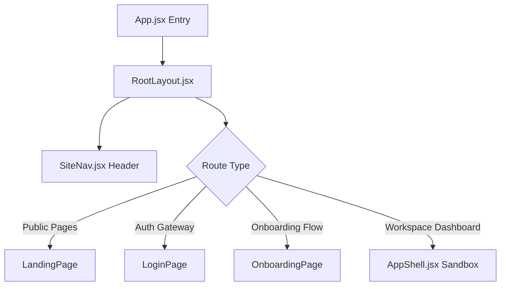
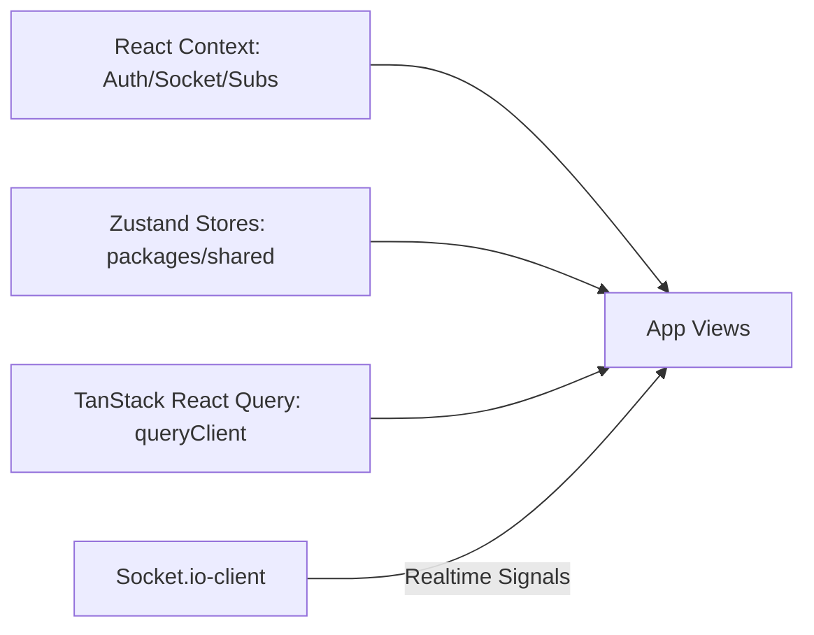

# ProMatch — Technical & Visual Design Architecture

This document serves as the **central design and architecture specification** for the ProMatch frontend monorepo. It details the visual identity systems, structural hierarchies, multi-project workspace topologies, and data management flows that shape the platform.

---

## 1. Executive Summary & Design Philosophy

ProMatch is a professional, swipe-based networking platform styled as a **"Tinder × LinkedIn for Nerds."** It connects three distinct user classes: students looking for co-founders/hackathon teammates, industry professionals looking to advise or join startups, and accelerators/clubs hosting events.

### The Creative North Star: "The Academic Luminary"
Unlike traditional, overly dense professional networks or cookie-cutter educational platforms, ProMatch is designed with an **editorial approach**. The user experience mimics a high-end academic journal blended with modern, fluid, dark-mode elements.

*   **Intentional Asymmetry:** Grid structures and components utilize slight offsets, overlapping layers, and breathing room to break the monotonous "card grid" template feel.
*   **The "No-Line" Contrast System:** Visual dividers (borders) are heavily discouraged. Content boundaries, sections, and containment hierarchies are defined by ambient background shade transitions (e.g., nesting white cards against soft tinted gray or cream backdrops).
*   **Light-to-Dark Contrast Dynamics:** The platform establishes a primary premium dark environment utilizing vibrant glows and technical overlays (orbs, grids, canvas animations), while supporting an official light-theme fallback (`pm-light-theme`) mapped to professional cream and blue tones.

---

## 2. Monorepo & Project Structure

The codebase is organized as a monorepo leveraging npm workspaces, separating shared assets, web applications, and mobile frontends.

### Directory Schema Overview

```
Frontend-TFN/
├── apps/
│   └── mobile/                 ← React Native Expo mobile application
├── packages/
│   ├── shared/                 ← Common API clients, state stores, and query clients
│   └── tokens/                 ← Common visual style tokens (spacing, color codes)
├── src/                        ← Root JavaScript React App (Main Web Client)
├── Frontend/                   ← Alternate TypeScript React App (Tailwind CSS v4 Spec)
├── package.json                ← Root npm workspaces configuration
└── DESIGN.md                   ← (This file) Core design system specification
```

### Monorepo Workspaces

1.  **Root Web App ([src/](file:///c:/Users/shyle/OneDrive/Documents/Projects/Frontend-TFN/src)):** The current production web application built using **Vite 5**, **React 18**, and a custom modular structure powered by **Vanilla CSS**.
2.  **TypeScript Migration spec ([Frontend/](file:///c:/Users/shyle/OneDrive/Documents/Projects/Frontend-TFN/Frontend)):** An alternate spec-compliant app constructed with **Vite 8**, **React 19**, and styled with **Tailwind CSS v4** utilizing TypeScript.
3.  **Mobile Client ([apps/mobile/](file:///c:/Users/shyle/OneDrive/Documents/Projects/Frontend-TFN/apps/mobile)):** A mobile application built using **Expo**, **React Native**, and styled via **NativeWind/Tailwind**.
4.  **Shared Hooks & Store Package ([packages/shared/](file:///c:/Users/shyle/OneDrive/Documents/Projects/Frontend-TFN/packages/shared)):** Contains shared services:
    *   `api/`: Axios instances and endpoints wrapper ([packages/shared/src/api/client.js](file:///c:/Users/shyle/OneDrive/Documents/Projects/Frontend-TFN/packages/shared/src/api/client.js)).
    *   `stores/`: Zustand state handlers for auth, chat, sidebar and subscriptions ([packages/shared/src/stores/index.js](file:///c:/Users/shyle/OneDrive/Documents/Projects/Frontend-TFN/packages/shared/src/stores/index.js)).
    *   `query/`: Global TanStack query client settings ([packages/shared/src/query/index.js](file:///c:/Users/shyle/OneDrive/Documents/Projects/Frontend-TFN/packages/shared/src/query/index.js)).
    *   `socket/`: Real-time bidirectional socket.io interfaces ([packages/shared/src/socket/client.js](file:///c:/Users/shyle/OneDrive/Documents/Projects/Frontend-TFN/packages/shared/src/socket/client.js)).
5.  **Design System Tokens ([packages/tokens/](file:///c:/Users/shyle/OneDrive/Documents/Projects/Frontend-TFN/packages/tokens)):** The primary library holding key theme values like margins, radii, fonts, and hex colors, providing Tailwind configuration mappings in [tailwind.js](file:///c:/Users/shyle/OneDrive/Documents/Projects/Frontend-TFN/packages/tokens/src/tailwind.js).

---

## 3. Design System & Visual Style Guide

The visual layout rules are driven by common variables declared in [tinderfornerds-dark.css](file:///c:/Users/shyle/OneDrive/Documents/Projects/Frontend-TFN/src/styles/tinderfornerds-dark.css).

### 3.1 Styling Variables & Tokens

*   **Colors (Main Brand Palette):**
    *   `--primary`: `#0084FF` (Active links, main buttons)
    *   `--primary-container`: `#319AFF` (Bright blue gradient anchor)
    *   `--secondary-fixed`: `#111A3E` (Deep navy blue for high-contrast headers)
    *   `--tertiary`: `#FF801E` (Warm accent orange, warning signals)
    *   `--success`: `#15803D` (Positive matching state)
    *   `--error`: `#BA1A1A` (Critically red)
*   **Typography Scale:**
    *   **Display Font:** `Fustat` / `Cabinet Grotesk` (For headlines and hero copy)
    *   **Body & Utility Font:** `Inter` / `Satoshi` (For inputs, lists, paragraphs)
    *   **Code Font:** `JetBrains Mono` (For stats, unique codes, IDs)
*   **Radii scale:**
    *   `--radius-sm` (4px): Selection fields and inputs
    *   `--radius-md` (12px): Standard action buttons
    *   `--radius-xl` (24px): Dashboard cards

### 3.2 Key Visual Principles

*   **The Layering Scale:** Rather than using heavy drop shadows, elevation is achieved via structural shades:
    *   **Level 0 (Base Canvas):** Background light theme shades (`#f8fafc` or `#f8f4ec`)
    *   **Level 1 (Layer Inset):** `surface-container-low` (`rgba(255, 255, 255, 0.45)`)
    *   **Level 2 (Cards):** Base white surface (`#ffffff`) with subtle shadows (`0 4px 10px rgba(17, 26, 62, 0.06)`)
*   **Atmospheric Overlays:** App screens integrate custom canvas visual effects (like the grid distortions in [GridDistortion.jsx](file:///c:/Users/shyle/OneDrive/Documents/Projects/Frontend-TFN/src/components/ui/GridDistortion.jsx)) layered in the background shell.

---

## 4. Routing & Shell Layout

The platform handles route management inside [App.jsx](file:///c:/Users/shyle/OneDrive/Documents/Projects/Frontend-TFN/src/App.jsx) backed by React Router.

### 4.1 Page Wrappers and Shells
All authenticated routes are nested inside [RootLayout.jsx](file:///c:/Users/shyle/OneDrive/Documents/Projects/Frontend-TFN/src/components/layout/RootLayout.jsx).



*   **[SiteNav.jsx](file:///c:/Users/shyle/OneDrive/Documents/Projects/Frontend-TFN/src/components/layout/SiteNav.jsx):** Automatically resolves header links based on whether a user is logged in and their assigned workspace role.
*   **[AppShell.jsx](file:///c:/Users/shyle/OneDrive/Documents/Projects/Frontend-TFN/src/components/layout/AppShell.jsx):** Standard dashboard container. It implements loading skeletons, responsive gutters, and locks the Ctrl+K / Cmd+K command search palette.

---

## 5. Domain Modules & User Personas

ProMatch routes and actions dynamically adapt based on three target roles. The configuration maps these roles inside [authConfig.js](file:///c:/Users/shyle/OneDrive/Documents/Projects/Frontend-TFN/src/modules/auth/authConfig.js).

### 5.1 Student Persona
*   **Target Audience:** Hackathon builders, computer science students, project creators.
*   **Visual Color Anchor:** Coral (`#FF4B6E` in spec) / Bright Blue (`#0084FF` in code).
*   **Primary Landing:** `/student/home` ([StudentHomePage.jsx](file:///c:/Users/shyle/OneDrive/Documents/Projects/Frontend-TFN/src/modules/student/pages/StudentHomePage.jsx))
*   **Main Sub-Routes:**
    *   `/student/discover` — The signature card swiper swiping matches ([DiscoverPage.jsx](file:///c:/Users/shyle/OneDrive/Documents/Projects/Frontend-TFN/src/modules/dashboard/pages/DiscoverPage.jsx)).
    *   `/student/feed` — Real-time social project status streams ([StudentFeedPage.jsx](file:///c:/Users/shyle/OneDrive/Documents/Projects/Frontend-TFN/src/modules/student/pages/StudentFeedPage.jsx)).
    *   `/student/connections` — Lists matched cards ([ConnectionsPage.jsx](file:///c:/Users/shyle/OneDrive/Documents/Projects/Frontend-TFN/src/modules/dashboard/pages/ConnectionsPage.jsx)).
    *   `/student/sessions` — Scheduling meetings and video chat sessions ([SessionsPage.jsx](file:///c:/Users/shyle/OneDrive/Documents/Projects/Frontend-TFN/src/modules/dashboard/pages/SessionsPage.jsx)).

### 5.2 Professional Persona
*   **Target Audience:** Tech leads, advisors, startup professionals, freelancers.
*   **Visual Color Anchor:** Deep LinkedIn Blue (`#0A66C2`).
*   **Primary Landing:** `/pro/overview` ([ProOverviewPage.jsx](file:///c:/Users/shyle/OneDrive/Documents/Projects/Frontend-TFN/src/modules/pro/pages/ProOverviewPage.jsx))
*   **Main Sub-Routes:**
    *   `/pro/analytics` — Metrics on swipe feedback and matches.
    *   `/pro/discover` — Vetted talent reels feed.
    *   `/startup/hiring` — Dedicated candidate pipeline boards.

### 5.3 Organization Persona
*   **Target Audience:** Google Developer Groups (GDG), university clubs, incubators.
*   **Visual Color Anchor:** Gold (`#F5A623`).
*   **Primary Landing:** `/org/dashboard` ([OrgDashboardPage.jsx](file:///c:/Users/shyle/OneDrive/Documents/Projects/Frontend-TFN/src/modules/org/pages/OrgDashboardPage.jsx))
*   **Main Sub-Routes:**
    *   `/org/events` — Managing hosted events and attendee cohorts.
    *   `/student/events/host` — Organizing community panels or networking nights ([HostEventPage.jsx](file:///c:/Users/shyle/OneDrive/Documents/Projects/Frontend-TFN/src/modules/dashboard/pages/HostEventPage.jsx)).

---

## 6. CSS Organization and Architecture

All styling sheet files reside inside [src/styles/](file:///c:/Users/shyle/OneDrive/Documents/Projects/Frontend-TFN/src/styles/). The CSS is completely modular:

1.  **Global Base CSS:** [tinderfornerds-dark.css](file:///c:/Users/shyle/OneDrive/Documents/Projects/Frontend-TFN/src/styles/tinderfornerds-dark.css) provides variables for fonts, spacing ratios, and theme setups.
2.  **Shared UI Elements:** [ui-library.css](file:///c:/Users/shyle/OneDrive/Documents/Projects/Frontend-TFN/src/styles/ui-library.css) handles cards (`.pm-ui-card`), standard inputs (`.pm-input`), modals (`.pm-modal`), and loading shimmers.
3.  **App Grid Structure:** [site-layout.css](file:///c:/Users/shyle/OneDrive/Documents/Projects/Frontend-TFN/src/styles/site-layout.css) configures standard page boxes, wrapper zones, and theme background rules.
4.  **Feature Styles:** Indivudal layout sheets manage feature-specific boundaries (e.g. `messages.css` for chat thread panels, `calendar.css` for grid dates).
5.  **Imports Ordering:** All styles are imported sequentially in the main entrypoint [main.jsx](file:///c:/Users/shyle/OneDrive/Documents/Projects/Frontend-TFN/src/main.jsx) to ensure overrides (like `site-layout.css` and `mobile.css`) win specificity rules.

---

## 7. State & Data Layer



*   **Session Management:** Handled dynamically via `AuthContext` (stored inside `localStorage` under `pm_user` to persist sessions) and synchronized with the shared Zustand store ([userStore.js](file:///c:/Users/shyle/OneDrive/Documents/Projects/Frontend-TFN/packages/shared/src/stores/userStore.js)).
*   **Real-time Socket Layer:** [SocketProvider.jsx](file:///c:/Users/shyle/OneDrive/Documents/Projects/Frontend-TFN/src/context/SocketProvider.jsx) hooks active browser tabs into the backend websocket socket client for immediate typing notifications, live chat messages, and connection alerts.
*   **Cache & API Requests:** The shared client utilizes a custom axios fetcher mapped to React Query configurations inside the workspaces, ensuring proper caching, pagination, and query key deduplication.lerts. For "Warning" or "Highlight," use `tertiary` (#A70125).